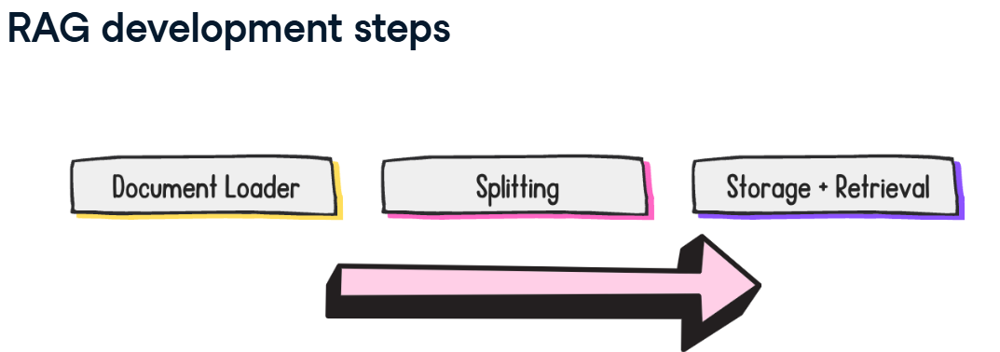

# Retrieval Augmented Generation (RAG)

RAG  
Pre-trained language models don't have access to external data sources - their understanding comes purely from their training data. This means that if we require our model to have knowledge that goes beyond its training data, which could be company data or knowledge of more recent world events, we need a way of integrating that data. In RAG, a user query is embedded and used to retrieve the most relevant documents from the database. Then, these documents are added to the model's prompt so that the model has extra context to inform its response.

RAG development steps  
There are three primary steps to RAG development in LangChain. 
- The first is loading the documents into LangChain with document loaders. 
- Next, is splitting the documents into chunks. Chunks are units of information that we can index and process individually. 
- The last step is encoding and storing the chunks for retrieval, which could utilize a vector database if that meets the needs of the use case.


## 1. Document Loader
LangChain has different classes to load documents in different format such as: pdf, csv, html

https://python.langchain.com/docs/integrations/doument_loaders

### PDF document loader
```ruby
from langchain_community.document_loaders import PyPDFLoader
loader = PyPDFLoader("paht/to/file/attention_is_all_you_need.pdf") # Load the PDF file

data = loader.load() # Load the PDF file into memory
print(data[0])
```


### CSV document loader
```ruby
from langchain_community.document_loaders.csv_loader import CSVLoader
loader = CSVLoader("fifa_countries_audience.csv") # Load the PDF file

data = loader.load() # Load the PDF file into memory
print(data[0])
```


### HTML document loader
```ruby
from langchain_community.document_loaders.csv_loader import CSVLoader
loader = CSVLoader("fifa_countries_audience.csv") # Load the PDF file

data = loader.load() # Load the PDF file into memory
print(data[0])
```


<!-- ------------------------------------------------------------------------------------------------------------------- -->

## 2. Splitting


To counteract lost context during chunk splitting, a chunk overlap is often implemented. We selected two chunks and a chunk overlap shown in green.


#### What is the best document splitting strategy?
There isn't one document splitting strategy that works for all situations. We should experiment with multiple methods, and see which one strikes the right balance between retaining context and managing chunk size. 

We will compare two document splitting methods: 
- CharacterTextSplitter and 
- RecursiveCharacterTextSplitter.   
Optimizing this document splitting is an active area of research, so keep an eye out for new developments!


## 3. Storage and Retrieval