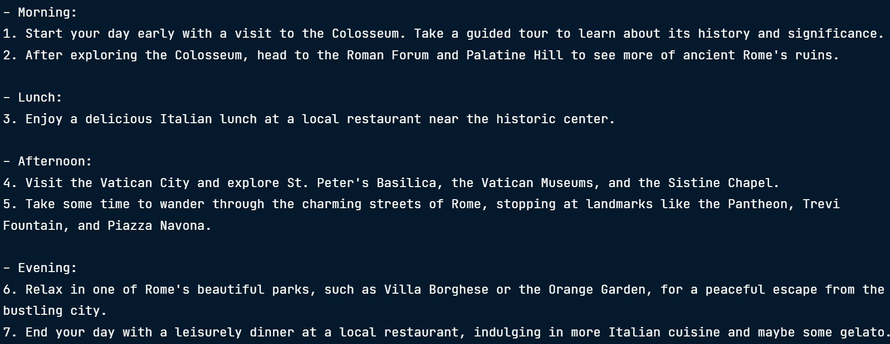

# Developing LLM Applications with LangChain


## Prompting strategies for chatbots
Use LangChain to start implementing prompting strategies for chatbots.

### Finding the right models
Thousands of LLMs are available in LangChain via the Hugging Face Hub API. To find language models specifically optimized for chat, search the models section of Hugging Face and filter on Question Answering.  Many are also fine-tuned on domain-specific datasets, so they are better at capturing the nuance of a particular region, culture, or task.

### Prompt Templates
Prompt templates act as reusable recipes for generating prompts from user inputs in a flexible and modular way. Templates can include instructions, examples, or any additional context that might help the model complete the task.

```ruby
# use LangChain PromptTemplate class
from langchain_core.prompts import PromptTemplate 

# creting a template string
template = "You are an artificial intelligence assistant, answer the question. {question}" 

# convert the string into a prompt template
prompt_template = PromptTemplate(template = template, input_variables = ["question"])

print(prompt_template.invoke({"question": "What is Langchain?"}))
```


### Integrate PromptTemplate with LLMs
```ruby
# choose a question-answering LLM from Hugging Face
from langchain_huggingface import HuggingFaceEndpoint

llm = HuggingFaceEndpoint(repo_id = 'tiiuae/falcon-7b-instruct', huggingfacehub_api_token = token )

# integrate the prompt templaet and model, use LangChain Expression Language or LCEL
llm_chain = prompt_template | llm

question = "What is LangChain?"
print(llme_chain.invoke({"question":question})) # pass an input to this chain
```


### Chat models
Chat models have a different prompt template class: ChatPromptTemplate  
This allows to specify a series of messages to pass to the chat model.

```ruby
from langchain_core.prompts import ChatPromptTemplate

# series of messages are structured as a list of tuples, where each tuple contains a role and message pair.
# list is then passed to the .from_messages() method to create the template.
prompt_template = ChatPromptTemplate.from_messages(
    [
        ("system","You are soto zen master Roshi"),
        ("human", "What is the essense of Zen"),
        ("ai", "When you are hungry, eat. When you are tired, sleep.")
        ("human", "Respond to the question: {question}")
    ]
)

# integrating ChatPromptTemplate
from langchain_openai import ChatOpenAI

llm = ChatOpenAI(model = "gpt-4o-mini", api_key = openai_api_key)

# create a chain
llm_chain = prompt_template | llm

question = "what is the sound of one hand clapping?"
response = llm_chain.invoke({"question":question})

print(response.content)
```


## Few-shot prompting

convert DataFrame to list of dicts
```ruby
examples = df.to_dict(orient = "records")
```

#### creating a prompt template
```ruby
from langchain_core.prompts import FewShotPromptTemplate, PromptTemplate

# creating a prompt template
example_prompt = PromptTemplate.from_template("Question: {question} \n {answer}")

prompt = example_prompt.invoke(
    {
        "question": "What is the capital of Italy?"
        "answer": "Rome"
    }
)
print(prompt.text)
```


### creating a few shot prompt template
```ruby
# creating a few shot prompt template
prompt_template = FewShotPromptTemplate(
    examples = examples, # the list of dicts
    example_prompt = example_prompt, # formatted template
    suffic = "Question: {input}", # suffic to add to the input
    input_variables = ["input"] # input_variables
)

# Invoke the prompt template
prompt = prompt_template.invoke({"input": "What is the name of Henry Campbell's dog"})
print(prompt.text)
```


```ruby
# Integrating with the LLM Chain
from langchain_openai import ChatOpenAI

llm = ChatOpenAI(model = "gpt-4o-mini", api_key = openai_api_key)

# create a chain
llm_chain = prompt_template | llm
response = llm_chain.invoke({"input":"What is the name of Henry Campbell's dog"})
print(response.content)
```

## 2. Chains and Agents
### 2.1 Sequential chains
```ruby
destination_prompt = PromptTemplate(
    input_variables = ["destination"],
    template = "I am planning a trip to {destination}. Can you suggest some activities to do there?"
)

activities_prompt = PromptTemplate(
    input_variables = ["activities"],
    template = "I only have one day, so can you create an itinerary from your top three activities: {activities}."
)

# define model
llm = ChatOpenAI(model = "gpt-4o-mini", api_key = openai_api_key)
seq_chain = ({"activities": destination_prompt | llm | StrOutputParser()})
    | activities_prompt
    | llm
    | StrOutputParser()

print(seq_chain.invoke("destination":"Rome"))
```


<!-- ------------------------------------------------------------------------------------------------- -->

### 2.2 Introduction to LangChain agents


To implement agents, we'll be using LangGraph, which is branch of the LangChain ecosystem specifically for designing agentic systems, or systems including agents. Like LangChain's core library, it's is built to provide a unified, tool-agnostic syntax.   

```ruby
# pip install langgraph == 0.066

from langgraph.prebuilt import create_react_agent
from langchain_community.agent_toolkits.load_tools import load_tools
from langchain_openai import ChatOpenAI

llm = ChatOpenAI(model="gpt-4o-mini", api_key='OpenAI_API_TOKEN') 
tools = load_tools(["llm-math"], llm  = llm) #define the tools
agent = create_react_agent(tools = tools) # Create an agent with the tools

message = agent.invoke({"messages:"[("human","What is the square root of 101?")]}) # Invoke the agent
print(message)
```


```ruby
print(messages["messages"][-1].content)
```


#### Tools
```ruby
# Custom tools for agent
# tool formats
from langchain_community.agent_toolkits.load_tools import load_tools

tools = load_tools(["llm-math", "llm-wikipedia"], llm = llm)
print(tools[0].name) #get the name of the first tool
print(tools[0].format) #get the format of the first tool
print(tools[0].description) #get the description of the first tool

print(tools[0].return_direction) #get the return direction of the first tool
```

##### from functions to tools
```ruby
from langchain_core.tools import tool

@tool
def financial_report(company_name:str, revenue:int, expenses:int) -> str:
    '''Generate a financial report for a company that calculates the net income.'''
    net_income = revenue - expenses

    report = f"Financial Report for {company_name}:\n"
    report += f"Revenue: ${revenue}\n"
    report += f"Expenses: ${expenses}\n"
    report += f"Net Income: ${net_income}\n"
    return report

# use ReAct agent
from langgraph.prebuilt import create_react_agent

llm = ChatOpenAI(model="gpt-4o-mini", api_key=openai_api_key, temperature=0)
agent = create_react_agent(llm, [financial_report])

messages = agent.invoke({"messages": [("human", "Generate a financial report for ABC Corp with revenue of $100,000 and expenses of $75,000.")]})
print(messages)
```


print(messages['messages'][-1].content)


## 3. Retrieval Augmented Generation (RAG)

RAG  
Pre-trained language models don't have access to external data sources - their understanding comes purely from their training data. This means that if we require our model to have knowledge that goes beyond its training data, which could be company data or knowledge of more recent world events, we need a way of integrating that data. In RAG, a user query is embedded and used to retrieve the most relevant documents from the database. Then, these documents are added to the model's prompt so that the model has extra context to inform its response.

RAG development steps  
There are three primary steps to RAG development in LangChain. 
- The first is loading the documents into LangChain with document loaders. 
- Next, is splitting the documents into chunks. Chunks are units of information that we can index and process individually. 
- The last step is encoding and storing the chunks for retrieval, which could utilize a vector database if that meets the needs of the use case.

