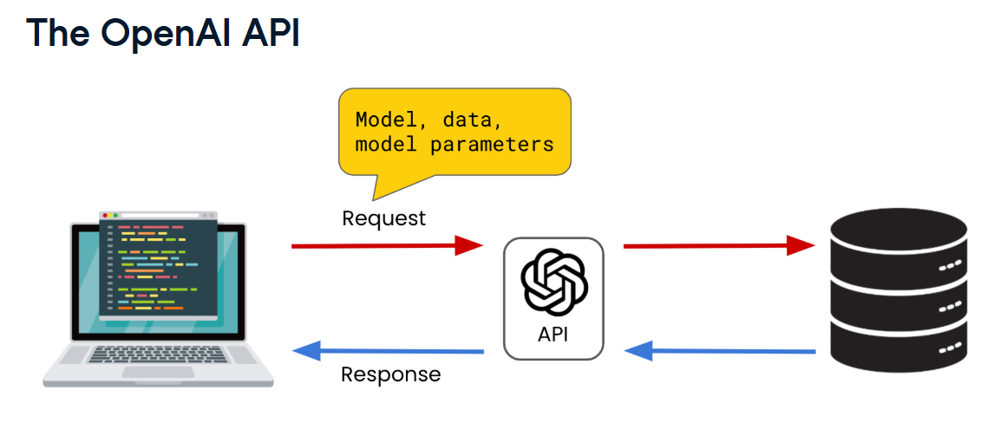
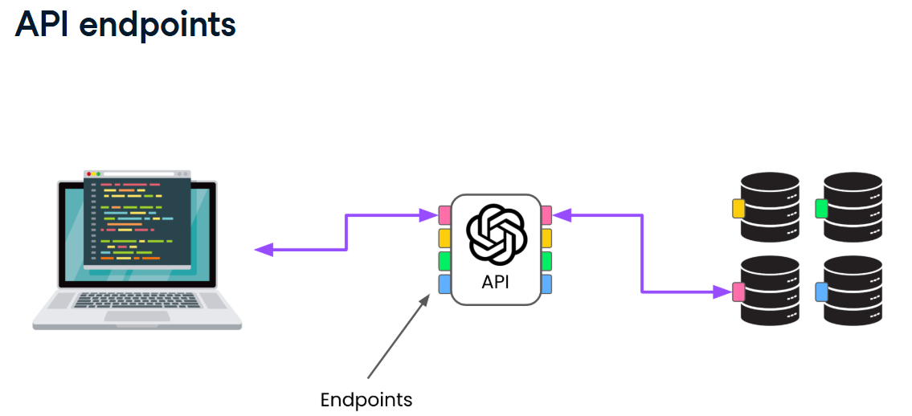
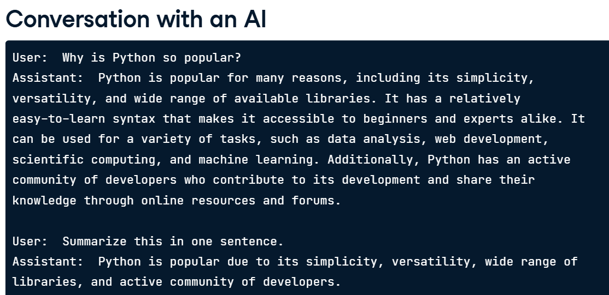

## API
###  OpenAI API = interface for accessing OpenAI models  


### API endpoints  
users make requests for different services to different API endpoints.  


### API authentication
Controls on access to API endpoint services (often unique key)

### API usage costs
For OpenAI, costs are dependent on the model requested and the size of the model input and output. 

## Creating an API key
OpenAI's own Python library >> 
```ruby
# importing OpenAI class
from openai import OpenAI

# The client configures the environment for communicating with the API. specify API key
client = OpenAI(api_key="Enter your key here")

#request code Q&A
# creating a request code to the chat completions endpoint by calling .create() method
response = client.chat.completions.creat(
    # specify the model
    model = "gpt-4o-mini",
    # specify the message to send
    message = [{"role":"user", "content": "What is the OpenAI API?"}]
)
print(response)
# The response from the API is a ChatCompletion object, which has attributes for accessing different information. It has an id attribute, choices, created, model, and other attributes

print(response.choices)
print(response.choices[0])
print(response.choices[0].message)
print(response.choices[0].message.content)
```

#### Controlling response randomness
- temperature: control on determinism, Ranges from 0 (highly deterministic) to 2(very random)
```ruby
response = client.chat.completions.creat()
    model = "gpt-4o-mini",
    message = [{"role":"user", "content": "What is the OpenAI API?"}],
    temperature = 2
)
print(response.choices[0].message.content)
```
#### Content transformation
```ruby
response = client.chat.completions.creat()
    model = "gpt-4o-mini",
    message = [{"role":"user", "content": prompt}],
    temperature = 2
)
print(response.choices[0].message.content)
```

```ruby
prompt = "Create a tagline for a new hot dog stand."
response = client.chat.completions.creat()
    model = "gpt-4o-mini",
    message = [{"role":"user", "content": prompt}],
    temperature = 2
)
print(response.choices[0].message.content)
```

#### Controlling the response lenght
max_tokens parameter >> Tokens are a unit of one or more characters used by language models to understand and interpret text.  
```ruby
response = client.chat.completions.creat()
    model = "gpt-4o-mini",
    message = [{"role":"user", "content": prompt}],
    max_tokens = 30
)
print(response.choices[0].message.content)
```

#### Multiple roles
```ruby
message = [{"role":"system", "content": "you are a data science tutor who speaks concisely."},
           {"role":"user", "content": "what is the difference between mutable and immutable objects?"}
          ]
```

#### Storing Responses
storing history / multi-turn chat completions with GPT
```ruby
message = [{"role":"system", "content": "you are a data science tutor who provides short, simple explanations"}]

# user query list
user_qs = ["Why is Python so popular?", "Summarize this in one sentence."]

# append ther user query list to message
for q in user_qs:
    print("User:", q)

    user_dict = {"role": "user", "content": q}
    messages.append(user_dict)

    response = client.chat.completions.create(
        model = "gpt-4o-mini",
        messages = messages
    )

    # to store the responses
    assistant_dict = {"role":"assistant", "content": response.choices[0].message.content}
    messages.append(assistant_dict)

    print("Assistant": response.choices[0].message.content, "\n")
```


## Speech-to-Text Transcription with Whisper
```ruby
# loading audio files
file_name = "meeting_recording.mp3"
audio_file = open(file_name, "rb")

# making a request to audio endpoint
response = client.audio.transcriptions.create(model = "whisper-1", file = audio_file)

print(response.text)
```

### Speech Translation with Whisper
```ruby
# loading audio files
file_name = "meeting_recording.mp3"
audio_file = open(file_name, "rb")

# making a request to audio endpoint
response = client.audio.translations.create(model = "whisper-1", file = audio_file)

print(response.text)
```

with prompt
```ruby
# loading audio files
file_name  = "meeting_recording.mp3"
audio_file = open(file_name, "rb")
prompt     = "The transcript is about AI trends and ChatGPT"
# making a request to audio endpoint
response = client.audio.translations.create(model = "whisper-1", file = audio_file, prompt = prompt)

print(response.text)
```

### Combining models
```ruby
audio_file = open(file_name, "rb")
audio_response = client.audio.transcriptions.create(model = "whisper-1", file = audio_file)
transcript = audio_response.text

prompt = "Extract the attendee names from the start of this meeting transcript: " + transcript

chat_response = client.chat.completions.create(
    model = "gpt-4o-mini",
    messages = [
        {"role": "user", "content":prompt}
    ]
)
print(chat_response.choices[0].message.content)
```