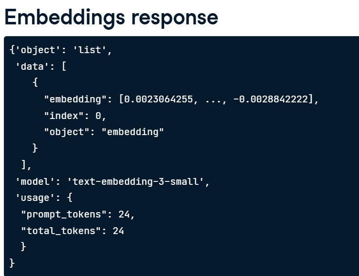

## Creating an Embeddings request from embeddings endpoint
```ruby
from openai import OpenAI

# to instantiate the OpenAI client and pass it our API key
client = OpenAI(api_key = "<OPENAI_API_KEY")

# create a request
response = client.embeddings.create(
    model = "text-embedding-3-small",
    # pass text to embed
    input = "Embeddings are a numerical represented of text that can be used to measure the relatedness between two pieces of text."
)
# convert the response to the dictionary
response_dict = response.model_dump()
print(response_dict)

print(response_dict['data'][0]['embedding'])
```


## Vector space
```ruby
# embedding multiple inputs
headline_text = [article['headline'] for article in articles]
headline_text

response = client.embeddings.create(
    model = 'text-embedding-3-small',
    input = headline_text
)
response_dict = response.model_dump()

# store the embedding to the articles dictionary >> articles  = [{"headline":"this is headline", "topic":"business", "embedding": embed}]
for i, article in enumerate(articles):
    article['embedding'] = response_dict['data'][i]['embedding']

print(artilces[:2])
```

How long is the embedding vector?
```ruby
len(articles[0]['embedding'])
```

### Implementing t-SNE 
(dimensionality reduction)
```ruby
from sklearn.manifold import TSNE
import numpy as np

embeddings = [article['embedding'] for article in articles]

tsne = TSNE(n_components = 2, perplexity = 5)
embeddings_2d = tsne.fit_transform(np.array(embeddings))
```
Visualizing the embeddings
```ruby
import matplotlib.pyplot as plt

plt.scatter(embeddings_2d[:,0], embeddings_2d[:,1])

topics = [article['topic'] for article in articles]
for i, topic in enumerate(topics):
    plt.annotate(topic, (embeddings_2d[i,0], embeddings_2d[i,1]))

plt.show()
```

## Text Similarity
<image src = "./image/2.png"/>

### measuring similarty >> cosine distance
```ruby
from scipy.spatial import distance
distance.cosine([0,1],[1,0])
```
Note:  
distances are ranges from 0-2. smaller means similar.  

```ruby
def create_embeddings(texts):
    response = client.embeddings.create(
        model = "text-embedding-3-small",
        input = texts
    )
    response_dict = response.model_dump()
    return [data['embedding'] for data in response_dict['data']]

print(create_embeddings(["Python is the best", "R is the best"])) 
# [[0.11, 0.22, ...],[0.222,0.98,....]]
print(create_embeddings("Python is the best")[0])
# [0.1, 0.2]


# calculate the similarity
from scipy.spatial import distance
import numpy as np

search_text = "computer"
search_embedding = create_embeddings(search_text)[0]

distances = [] #to store the distances between the articles headlines and search_text
for articles in articles:
    dist = distance.cosine(search_embedding, article['embedding'])
    distances.append(dist)

min_dist_ind = np.argmin(distances) #get the indes of the minimum distance embeddings from the array
print(articles[min_dist_ind]['headline'])
```


