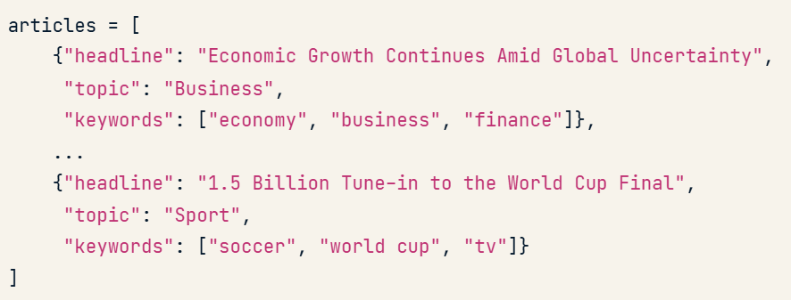
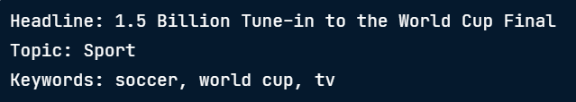
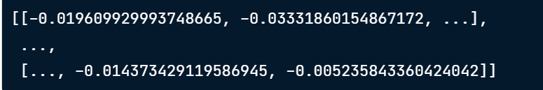
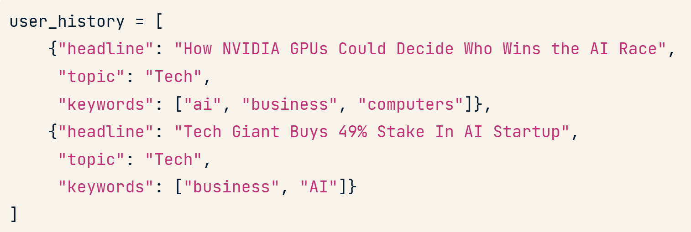
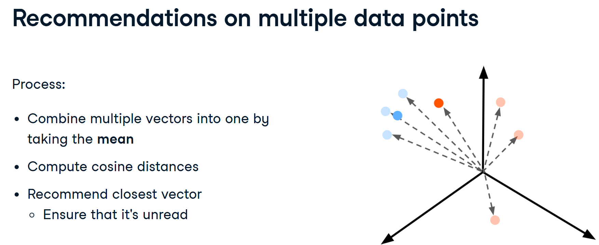
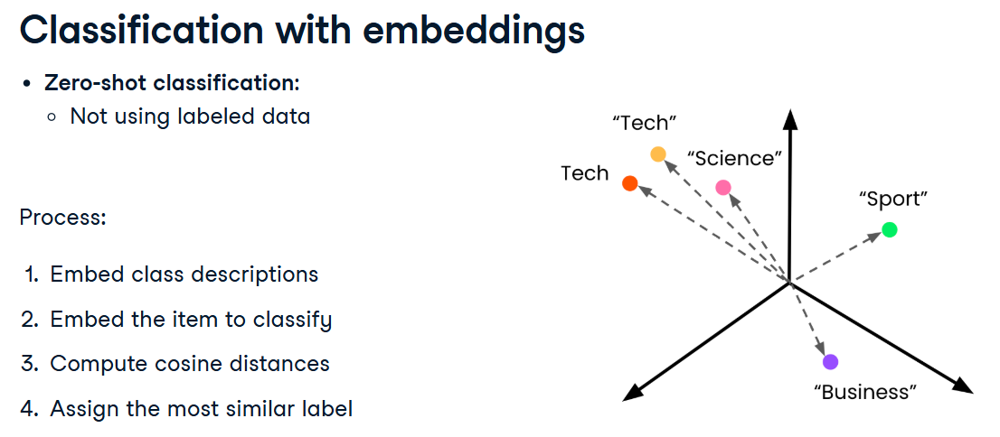

## Semantic Search using OpenAIAPI


#### Combining features into a single string for embedding
```ruby
def create_article_text(article):
    return f"""Headline: {article['headline']}
    Topic: {article['topic']}
    Keywords: {', '.join(article['keywords'])}"""
```


#### creating enriched embeddings 
```ruby
article_texts = [create_article_text(article) for article in articles] #formatting each article in the articles

article_embeddings = create_embeddings(article_texts) # call embedding function to embed the articles
print(article_embeddings)
```


#### computing distances
```ruby
from scipy.spatial import distance

def find_n_closest(query_vector, embeddings, n=3):
    distances = []
    for index, embedding in enumerate(embeddings):
        dist = distance.cosine(query_vector, embedding)
        distances.append({"distance":dist, "index":index})
    distances_sorted = sorted(distances, key = lambda x: x['distance']) #sort the distances
    return distances_sorted[0:n]

# returning the search results
query_text = "AI"
query_vector = create_embeddings(query_text)[0] #embed the input text

hits = find_n_closest(query_vector, article_embeddings) #calculate the distance

for hit in hits:
    article = articles[hit['index']]
    print(article)
```

## Recommendation system
#### 1. combining features
```ruby
def create_article_text(article):
    return f"""Headline: {article['headline']}
    Topic: {article['topic']}
    Keywords: {', '.join(article['keywords'])}"""

article_texts = [create_article_text(article) for article in articles] #formatting each article in the articles
current_aritcle_text = create_article_text(current_article)
```
#### 2. Creating Embeddings
```ruby
def create_embeddings(texts):
    response = openai.Embedding.create(
        model = "text-embedding-3-small",
        input = texts
    )
    response_dict = response.model_dump()
    return [data['embedding'] for data in response_dict['data']]

current_text_embeddings = create_embeddings(current_article_text)[0]
article_embeddings = create_embeddings(article_texts)
```
#### 3. Finding the most similar article
```ruby
def find_n_closest(query_vector, embeddings, n=3):
    distances = []
    for index, embedding in enumerate(embeddings):
        dist = spacial.distance.cosine(query_vector, embedding)
        distances.append({"distance":dist, "index":index})
    distances_sorted = sorted(distances, key = lambda x: x['distance']) #sort the distances
    return distances_sorted[0:n]

hits = find_n_closest(current_article_embeddings, article_embeddings) #calculate the distance

for hit in hits:
    article = articles[hit['index']]
    print(article['headline'])
```
#### 4. Adding user history



```ruby
# 4.1
# combining the user history
history_texts = [create_article_text(article) for article in user_history]
# embed the user history
history_embeddings = create_embeddings(history_texts)

# calculate the mean of the user history embedding
mean_history_embeddings = np.mean(history_embeddings, axis = 0)

# 4.2
# filtered the articles that are not in user history
article_filtered = [article for article in articles if article not in user_hisotory]
# combine features of the unseen article
article_texts = [create_article_text(article) for article in articles_filtered]
# embedding
article_embeddings = create_embeddings(article_texts)

#4.3
# calculate the cosine similarity of the articles
hits = find_n_closest(mean_history_embeddings, article_embeddings) #calculate the distance

for hit in hits:
    article = articles_filtered[hit['index']]
    print(article['headline'])
```

## Classification task


```ruby
# 1.
topics = [
    {'label':'Tech'},
    {'label':'Science'},
    {'label':'Sport'},
    {'label':'Business'},
]

# take label
class_descriptions = [topic['label'] for topic in topics]
# embec
class_embeddings = create_embeddings(class_descriptions)

# 2.
# article 
article = {"headline":"How NVIDIA GPUs could decide who wins the ai race", 
           "keywords": ["ai","business","computers"]}

# create single text and embed for the article
def create_article_text(article):
    return f"""Headline: {article['headline']}
    Keywords: {', '.join(article['keywords'])}"""

article_text = create_article_text(article)
article_embeddings = create_embeddings(article_text)[0]

# 3.compute cosine distances

def find_n_closest(query_vector, embeddings):
    distances = []
    for index, embedding in enumerate(embeddings):
        dist = spacial.distance.cosine(query_vector, embedding)
        distances.append({"distance":dist, "index":index})
    return min(distances, key=lambda x: x["distance"])
    
closet = find_closet(article_embeddings, class_embeddings)

label = topics[closet['index']]['label']
print(label)
```