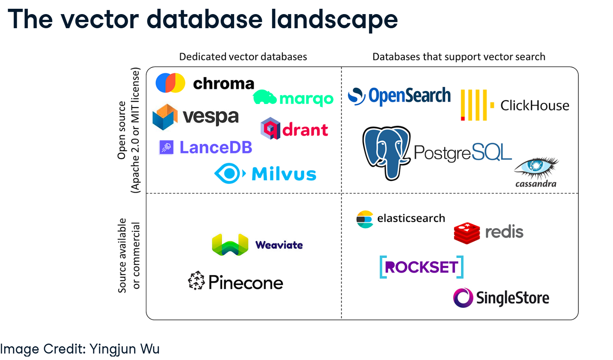
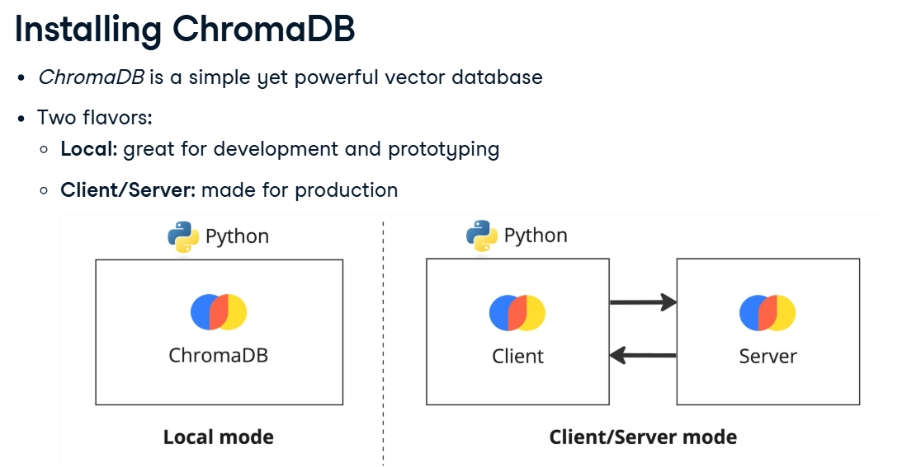
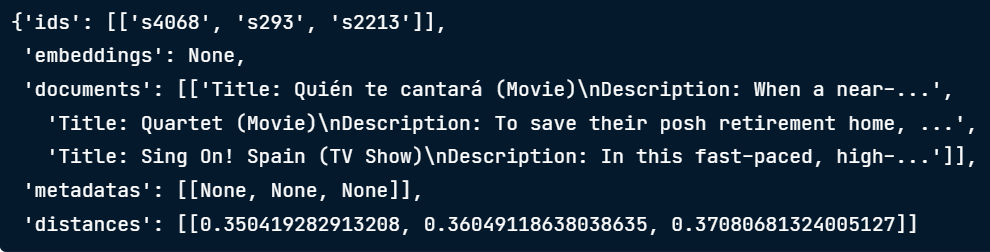
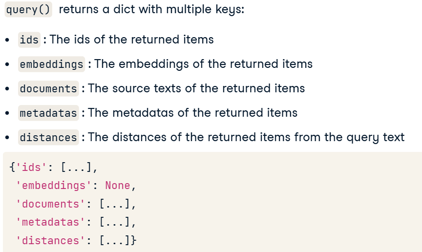
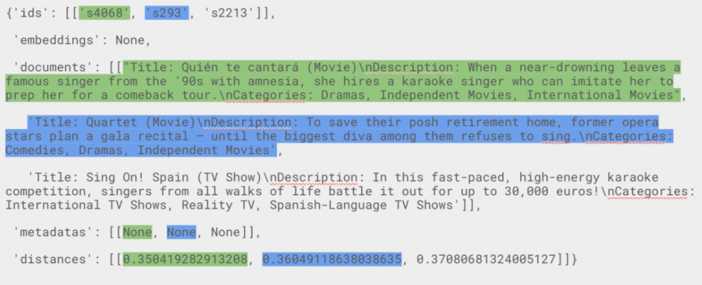
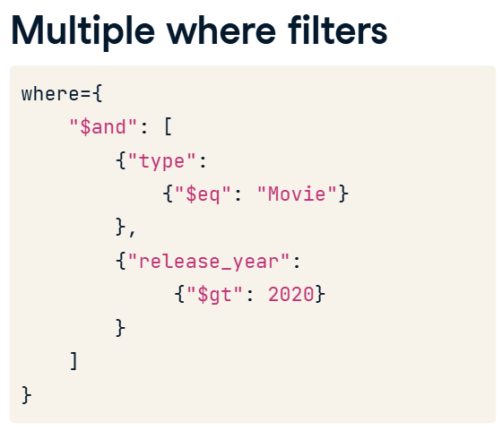

# Vector Database


## Building VectorDB with Chroma DB


### 1. Connecting to the database

```ruby
import chromadb
client = chromadb.PersistentClient(path = "/path/to/save/to")
```

### 2. creating a collection 
To add embeddings to the database, we must first create a collection. Collections are analogous to tables, where we can create as many as we want to store our data.  
collections are analogous to tables, collections are able to create embeddings automatically

```ruby
from chromdb.utils.embedding_functions import OpenAIEmbeddingFunction

collection = client.create_collection(
    name = "my_collection",
    embedding_function = OpenAIEmbeddingFunction(  #--embedding function
        model_name = "text-embedding-3-small",
        api_key    = "..."
    )
)
```

#### 2.1. Inpecting collections
```ruby
client.list_collections() #can verity that our collection was created successfully
```

### 3. Inserting embeddings
add embeddings into the collection.
#### 3.1 Single document
```ruby
collection.add(ids =["my-doc"], documents = ["This is the source text"])
```
#### 3.2 Multiple document
```ruby
collection.add(
    ids = ["my-doc-1", "my-doc-2"],
    documents = ["This is doc 1", "This is doc 2"]
)
```

#### 3.3 Inspecting a collection

```ruby
# counting documents in a collection
collection.count()

# peeking at the first 10 items
collection.peek()

# retrieved particular items
collection.get(ids=["s59"])
```

### Estimating embedding cost
$0.00002/1k tokens

count tokens with the tiktoken library
```ruby
pip install tiktoken

import tiktoken
enc = tiktoken.encoding_for_model("text-embedding-3-small")
total_tokens = sum(len(enc.encode(text)) for text in documents)

cost_per_1k_tokens = 0.00002
print("total tokens:", total_tokens)
print("Cost", cost_per_1k_tokens * total_tokens/1000)
```

## Querying the database

```ruby
# retrieved the collection
from chromdb.utils.embedding_functions import OpenAIEmbeddingFunction

collection = client.get_collection(
    name = "nextflix_titles",
    embedding_function = OpenAIEmbeddingFunction(  #--embedding function
        api_key    = "..."
    )  
) 

# quering the collection
result = collection.query(
    query_texts = ["movies where people sing a lot"],
    n_results = 3
)
print(result)
```




## Updating a collection
```ruby
collection.update(
    ids = ["id-1","id-2"],
    documents = ["New document 1", "New document 2"]
)
```

### Upserting a collection
if we're not sure if the IDs are already present in the table, use the upsert method. upsert will add the IDs to the collection if they aren't present, and update them if they are - a combination of the update and add methods.
```ruby  
collection.upsert(
    ids = ["id-1","id-2"],
    documents = ["New document 1", "New document 2"]
)
```

## Deleting a collection
```ruby
# delete
collection.delete(
    ids = ["id-1","id-2"]
)

# deleting everything
collection.reset(
    ids = ["id-1","id-2"]
)
```

## Multiple queryies and filtering

#### Adding metadata

```ruby
import csv

ids = []
metadatas = []

with open('netflix_titles.csv') as csvfile:
    reader = csv.DictReader(csvfile)
    for i, row in enumerate(reader):
        ids.append(row['show_id'])
        metadatas.append({
            "type": row['type'],
            "release_year": int(row['released_year'])
        })

# update the collection
collection.update(ids = ids, metadatas = metadatas)

result = collection.query(
    query_texts = reference_texts,
    n_results = 3,
    where = {
        "type":"Movie"
    }
)
```

